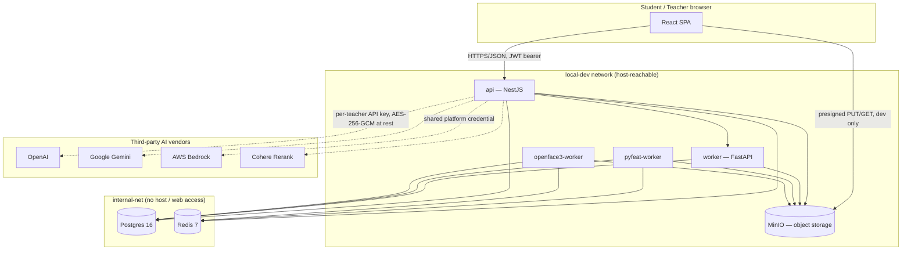
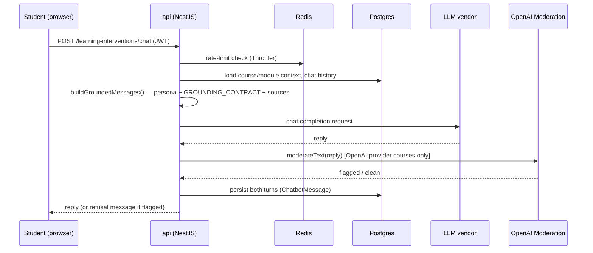

# Architecture & Data-Flow Overview

Satisfies SMU Cybersecurity Checklist items 18 (architecture/interface-flow/
data-flow diagrams) and 24 (asset inventory). Drawn directly from
`docker-compose.yml`, the service Dockerfiles, and `apps/api/prisma/schema.prisma`
— regenerate/update this whenever a service or network boundary changes, since
an outdated architecture diagram is worse than none for an incident responder.

## Service topology

**Network segmentation (item 17)**: Postgres and Redis sit on `internal-net`
only — unreachable from the `web` container or the host's browser. The `api`,
`worker`, `pyfeat-worker`, and `openface3-worker` containers bridge both
networks since they need to reach the data tier. MinIO stays on the shared
`local-dev` network because the browser talks to it directly for presigned
upload/download URLs in local dev — a real AWS deployment would replace MinIO
with S3 behind CloudFront/VPC endpoints, closing this gap without code changes
on the API side (the blob-storage client is already behind an interface).

## Request/data flow — student asks the chatbot a question

This is the highest-traffic AI path in the system and the one the checklist's AI
sections (54-65) are mostly about — see `docs/AI_MODEL_CARD.md` for the model
card and known limitations.

## Data-flow summary — where personal/sensitive data lands

See `docs/DATA_INVENTORY.md` for the full per-table breakdown. At the
architecture level, three storage destinations matter:

1. **Postgres** — everything structured: accounts, courses, chat transcripts,
   behavioral telemetry (keystroke/click/scroll timing), and biometric
   _inference_ output (emotion probabilities, gaze coordinates, pupil diameter).
2. **MinIO (→ S3 in production)** — the only place raw _media_ lands: webcam/
   screen recording segments (`RecordingSegment.minioKey`), uploaded course
   documents (`SourceDocument`), and exported activity-log bundles.
3. **Third-party LLM vendors** — chat/dialogue content is sent to whichever
   vendor a teacher configured, per the model card above. Nothing is sent to a
   vendor for training (item 54).

## Asset inventory (item 24)

Runtime base images and versions, from the Dockerfiles and `docker-compose.yml`
directly — this is the infrastructure-asset half of item 24; `docs/BOM.md` /
`docs/bom.csv` cover the ~950 npm-package half. All 8 fields the checklist
asks for are below: name, publisher, version, business purpose, asset
classification, approval/authorised date, end-of-service, location.

**Method note on "Approval/authorised date"**: there is no formal
asset-approval workflow for this project yet (the same gap already
documented under item 34 — access grants are direct, not request-and-approve).
Absent that, the date below is the most honest available proxy: the git
commit date the pin currently in `docker-compose.yml`/the Dockerfile was last
set, from `git log -1 --date=short -- <file>`. Treat it as "since when this
version has been in use," not evidence of a signed-off approval — adopting a
real approval step is a prerequisite this table can't manufacture on its own.

**Method note on "Asset classification"**: a lightweight infra taxonomy
(internal-network-only vs. internet-facing; whether the asset stores personal/
biometric data), not the formal PDPA data classification still pending legal
review under item 37 — those are different questions (network exposure vs.
data sensitivity) and this table only answers the first.

| Asset      | Business purpose                                                                             | Publisher                           | Version pinned                                                        | Classification                                                                                                            | Approved/pinned                                                                             | End-of-support                                                                                                                                                                                                                                                                                                                                                                      | Location                                                     |
| ---------- | -------------------------------------------------------------------------------------------- | ----------------------------------- | --------------------------------------------------------------------- | ------------------------------------------------------------------------------------------------------------------------- | ------------------------------------------------------------------------------------------- | ----------------------------------------------------------------------------------------------------------------------------------------------------------------------------------------------------------------------------------------------------------------------------------------------------------------------------------------------------------------------------------- | ------------------------------------------------------------ |
| Node.js    | JS runtime executing the API server and the web app's build/serve toolchain                  | OpenJS Foundation                   | 24-alpine (`.nvmrc` pins `24`; `engines.node >=22`)                   | Infra — internal runtime                                                                                                  | 2028-04-30 (Node 24 LTS maintenance end)                                                    | Upgraded from Node 20 (EOL 2026-04-30) to Node 24 LTS on 2026-09-15 for checklist item 23; this also satisfies the AWS SDK v3 requirement of Node ≥22 for updates after Jan 2027. Next review: before 2028-04.                                                                                                                                                                      | `apps/api`, `apps/web` containers                            |
| Python     | Runtime for the ML inference workers (gaze/pupil/affect/text-mining analysis)                | Python Software Foundation          | 3.12-slim (worker), 3.11-slim (pyfeat/openface3)                      | Infra — internal runtime                                                                                                  | 2026-05-19 (worker Dockerfiles)                                                             | 3.11 EOL Oct 2027, 3.12 EOL Oct 2028                                                                                                                                                                                                                                                                                                                                                | `apps/worker`, `apps/pyfeat-worker`, `apps/openface3-worker` |
| PostgreSQL | Primary relational datastore — all application, activity-log, and security-event data        | PostgreSQL Global Development Group | 16-alpine                                                             | Infra — internal-net only, stores personal/behavioral data                                                                | 2026-09-02 (`docker-compose.yml`)                                                           | 16.x supported until Nov 2028                                                                                                                                                                                                                                                                                                                                                       | `postgres` container, `internal-net` only                    |
| Redis      | Session cache, rate-limit/lockout counters, ephemeral 2FA/TOTP-setup state                   | Redis Ltd.                          | 7-alpine                                                              | Infra — internal-net only, no persistent personal data                                                                    | 2026-09-02 (`docker-compose.yml`)                                                           | Redis 7.x community support timeline per Redis Ltd. — track before their next major                                                                                                                                                                                                                                                                                                 | `redis` container, `internal-net` only                       |
| MinIO      | Object storage for webcam/screen recordings, uploaded course documents, exported log bundles | MinIO, Inc.                         | Digest-pinned: `quay.io/minio/minio@sha256:14cea493…` (was `latest`)  | Infra — stores biometric/recording data; browser has direct network access for presigned uploads (see item 17 note below) | 2026-09-15 (`docker-compose.yml` + `infra/docker-compose.yml`, pull and boot verified live) | Pinned by manifest digest rather than a `RELEASE.*` tag: Docker Hub's `minio/minio` repo now refuses pulls outright ("pull access denied", verified live 2026-09-15), so the pin points at quay.io, which serves the identical manifest digest (verified with `docker manifest inspect`). Review the pin when adopting a newer MinIO — there is no rolling tag to drift on anymore. | `minio` container                                            |
| ClamAV     | Malware scanning for teacher/student document uploads                                        | Cisco Talos                         | Digest-pinned: `clamav/clamav-debian@sha256:cc16781f…` (was `stable`) | Infra — internal-net only, security tooling                                                                               | 2026-09-15 (`docker-compose.yml`, pull and boot verified live)                              | The earlier "keep it rolling so signatures stay fresh" exception was retired: freshclam updates the virus-signature database at **runtime** into the `clamav_data` volume, so pinning the image freezes only the scanner software, not the signatures. Re-pin on ClamAV's cadence for engine updates.                                                                               | `clamav` container, `internal-net` only                      |
| nginx      | Serves the built web app and terminates the container's HTTP listener                        | nginx / F5                          | `1.30-alpine` (`nginxinc/nginx-unprivileged`)                         | Infra — internet-facing edge                                                                                              | 2026-08-06 (`apps/web/Dockerfile`)                                                          | Pinned to the 1.30 minor line rather than the rolling `alpine` tag; swapped to the unprivileged variant so the container doesn't run as root (see item 50 below).                                                                                                                                                                                                                   | `apps/web` Dockerfile production stage                       |

**Status on the "pin every rolling tag" follow-up**: complete as of
2026-09-15. nginx is pinned to the 1.30 minor line; MinIO and ClamAV are
pinned by manifest digest in `docker-compose.yml` (MinIO also in
`infra/docker-compose.yml`), with each pin's pull and boot verified against a
live Docker daemon — see the table rows above for the digests and the
Docker-Hub-vs-quay.io note.

## Container hardening (item 50)

Two containers now run as a non-root user instead of the image default (root):

- **`apps/api`'s production stage** — `USER node`, using the `node` account
  (uid 1000) that ships pre-created in the official `node:alpine` image.
- **`apps/web`'s production stage** — switched from `nginx:1.30-alpine` to
  `nginxinc/nginx-unprivileged:1.30-alpine`, a purpose-built non-root variant
  (hand-patching pid/temp-dir paths onto the root-oriented official image was
  considered and rejected as more error-prone to get right without a live
  stack to test against). Listens on 8080 instead of 80 as a result — non-root
  processes can't bind ports below 1024 — see `apps/web/nginx.conf`'s comment.

**Deliberately left alone this pass**: the `development` stage of `apps/api`
and `apps/web` (what `docker-compose.yml` actually runs today) and the Python
worker containers (`apps/worker`, `apps/pyfeat-worker`, `apps/openface3-worker`)
— all three are actively used by the current dev stack and likely write to
local disk (model caches, temp frames during video/ML processing), so a
root-vs-non-root permission mismatch there could break active local
development with no way to verify the fix in this environment. Worth a
dedicated pass once a live stack is available to test against.
